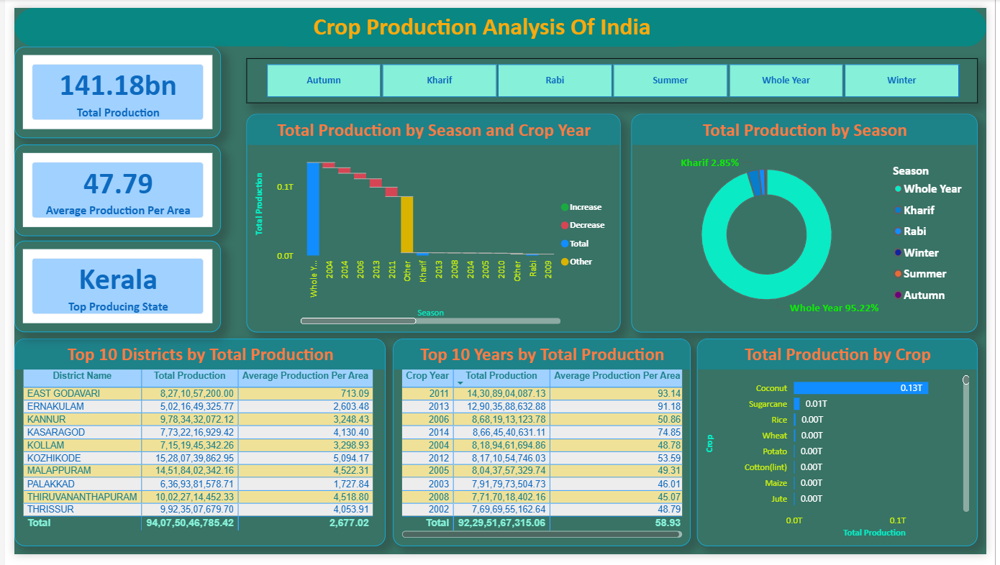
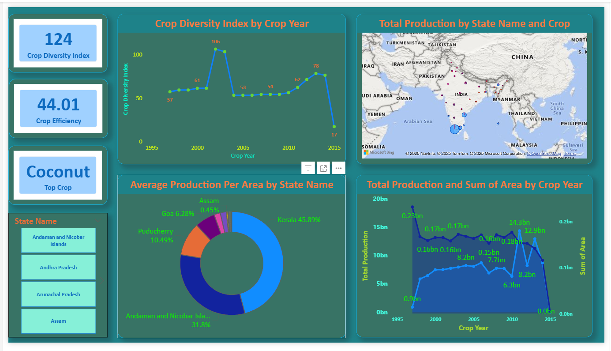

# 🌾 Crop Production Analysis of India | Power BI

## 📌 Project Overview
This project presents an interactive Power BI dashboard analyzing crop production trends across India. It provides insights into state-wise, crop-wise, seasonal, and year-wise agricultural production to support data-driven decision-making.

## 🛠 Tools & Technologies
- Power BI Desktop
- DAX
- Excel / CSV
- Data Modeling & Visualization

## 📊 Key KPIs
- Total Production: 141.18 Billion Tonnes
- Average Production Per Area: 47.79
- Crop Diversity Index: 124
- Crop Efficiency: 44.01
- Top Producing State: Kerala
- Top Crop: Coconut

## 📈 Dashboard Features
- Interactive KPI cards and slicers
- State-wise, crop-wise, and season-wise analysis
- Year-wise trend and top-performing analysis
- Custom report-page tooltips implemented to explain metric units

## 📁 Project Structure
Crop-Production-Analysis-India/
├── Dashboard/
│ └── Crop_Production_Analysis_India.pbix
├── Images/
│ ├── overview.png
│ └── detailed_analysis.png
├── Data/
│ └── crop_production_data.csv
├── README.md

## 🔍 Key Insights
- Kerala is the highest crop-producing state
- Coconut contributes the highest total production
- Whole Year season accounts for ~95% of total production
- Production trends vary significantly across years and seasons

## 🚀 How to Use
1. Download the `.pbix` file
2. Open it using Power BI Desktop
3. Refresh the data if required

## 📷 Dashboard Preview

### Overview & Insights

### Detailed Analysis

